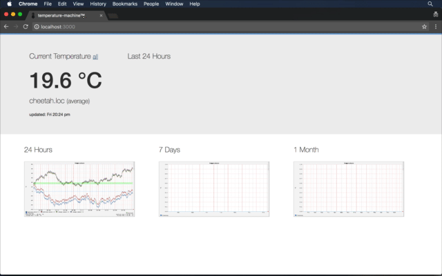

# Temperature Machine UI

A reactive UI for the [temperature-machine](https://github.com/tobyweston/temperature-machine) project to display temperatures from multiple sensors in multiple rooms. Built around the Raspberry Pi and [DS18B20](https://www.maximintegrated.com/en/products/analog/sensors-and-sensor-interface/DS18B20.html) temperature sensor.

The project was bootstrapped with [Create React App](https://github.com/facebookincubator/create-react-app), see it's [README](REACT.md).

## Development

Start the UI with 

    npm start
    
The development server will run up and serve the app. Goto [http://localhost:3000]([http://localhost:3000]).

To have the UI show meaningful data, run the `temperature-machine` app up. It will start on `localhost:11900` and the `proxy` setting in `package.json` will take care of the rest. See the proxy section of [REACT.md](https://github.com/tobyweston/temperature-machine-ui/blob/master/REACT.md#proxying-api-requests-in-development).

If you don't, you'll probably see `Error: Request failed with status code 500` and no images or data.

You can hack the js and css and the development server will compile everything and the browser will auto update with your changes.

## Build

Run the following.

    npm run build
    
Then copy the resulting deployment (resources) folder on the `temperature-machine`.